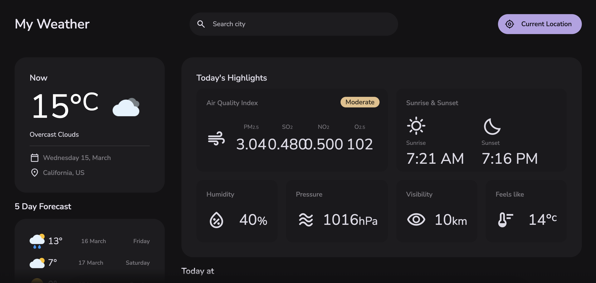

<div align="center">
  
  
  
  
  
  
  
  
  
  
  
  
  
  
  
  
  

  <h2 align="center">My Weather</h2>

 Real-time weather app using JavaScript and the OpenWeather API.
  
### 📸 Demo screenshot
  
</div>



### ⭐ Prerequisites

Before you begin, make sure you have met the following requirements:

* [Git](https://git-scm.com/downloads "Download Git") must be installed on your operating system.

* If you want to run the project locally you must have your [OpenWeather Api key](https://openweathermap.org/api "OpenWeather Api").

### 🚀 Run the project locally

To run **My Weather** locally, run this command in your git bash or terminal:

Linux and macOS:

```bash
sudo git clone https://github.com/iamjosuefischer/myweather.git
```

Windows:

```bash
git clone https://github.com/iamjosuefischer/myweather.git
```

Place your OpenWeather Api key in the *api.js* file:

```bash
const api_key = "";
```

### 📫 Contact

If you want to contact me you can write to me at [email](mailto:josuefischercraft@gmail.com).

### 📃 License

This project contains a license: **MIT License**.